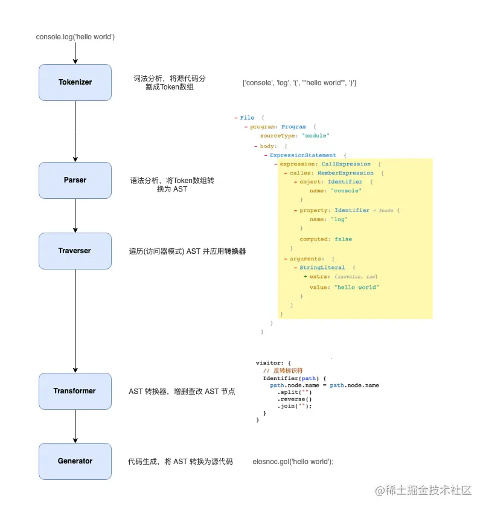
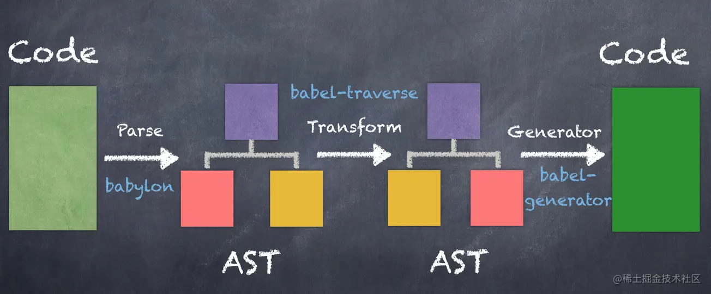

# Babel

## 概念

- 一个 JavaScript 翻译器
- 将 ECMAScript 2015+ 语法编写的代码转换为向后兼容的 JavaScript 语法，以便能够运行在各种环境中
- 通过 Polyfill 方式在目标环境中添加缺失的特性 （通过引入第三方 polyfill 模块，例如 core-js）

## 基本工作原理

- 第 1 步 解析（Parse）  
  通过解析器 babylon 将代码解析成抽象语法树，包括词法分析和语法分析，词法分析主要把字符流源代码（Char Stream）转换成令牌流（ Token Stream），语法分析主要是将令牌流转换成抽象语法树

- 第 2 步 转换（TransForm）  
  通过 babel-traverse plugin 对抽象语法树进行深度优先遍历，遇到需要转换的，就直接在 AST 对象上对节点进行添加、更新及移除操作，比如遇到箭头函数，就转换成普通函数，最后得到新的 AST 树

- 第 3 步 生成（Generate）  
  通过 babel-generator 将 AST 树生成 es5 代码，同时也能创建 Source Map 映射





## 配置

主要分为 presets 和 plugins

### .babelrc._ 和 babel.config._ 区别

- .babelrc.\_ 仅适用于项目的某个部分
- babel.config.\_ 会影响整个项目中的代码，包含 node_modules 中的代码
- 推荐使用 babel.config.\_，Babel 自身使用的就是这种格式

### presets

- 逆序处理，从后往前，这主要是为了确保向后兼容，由于大多数用户将 "es2015" 放在 "stage-0" 之前，
- 可以是数组、对象、字符串

```json
{
  "presets": [
    "presetA", // bare string
    ["presetA"], // wrapped in array
    ["presetA", {}] // 2nd argument is an empty options object
  ]
}
```

#### useBuiltIns

```json
{
  "presets": [
    [
      "@babel/preset-env",
      {
        "useBuiltIns": "usage",
        "debug": true,
        "corejs": 3 // 建议使用 3，core-js@2 分支中已经不会再添加新特性，新特性都会添加到 core-js@3
      }
    ]
  ]
}
```

- babel 在转译的时候，会将源代码分成 syntax（语法） 和 api 两部分来处理，语法处理通过配置 presets，
- babel 使用 polyfill 来处理 api，@babel/preset-env 中有一个配置选项 useBuiltIns，用来告诉 babel 如何处理 api，由于这个选项默认值为 false，即不处理 api，所以代码转译后默认没有处理 api，可以通过手动引入 polyfill，但是 polyfill 没有动态引入会增加包的体积
- 设置 useBuiltIns 的值为 "entry"，同时在源代码的最上方手动引入 `@babel/polyfill` 这个库（该库一共分为两部分，第一部分是 core-js，第二部分是 regenerator-runtime。其中 core-js 为其他团队开源的另一个独立项目），此时 babel 根据项目 browserslist，引入浏览器不兼容的 polyfill。需要在入口文件手动添加 `import '@babel/polyfill'`，会自动根据 browserslist 替换成浏览器不兼容的所有 polyfill
- 将 useBuiltIns 改为 "usage"，babel 就可以按需加载 polyfill，并且不需要手动引入 `@babel/polyfill`

##### 存在的问题

- polyfill 会直接在全局对象上定义方法，比如 Array.include，众所周知前端开发不鼓励污染全局变量，
- babel 会向翻译后的**每一个**文件原地定义许多帮助函数，用于转义语法，比如 `__spreadArray`、`__generator`,

### plugins

- 本质是一个 JS 程序, 指示 Babel 如何对代码进行转换
- 排列顺序很重要
- plugins 在 presets 之前运行
- plugins 顺序从前往后排列，与 presets 相反

## 核心与其周边

### @babel/core

- babel 使用了微内核的架构风格，也就是说它们的核心非常小，大部分功能都是通过插件扩展实现的，@babel/core 就是这个内核，包含核心功能
- 作用：
  - 加载和处理配置(config)
  - 加载插件
  - 调用 Parser 进行语法解析，生成 AST
  - 调用 Traverser 遍历 AST，并使用访问者模式应用'插件'对 AST 进行转换
  - 生成代码，包括 SourceMap 转换和源代码生成

### @babel/cli

命令行工具

### @babel/plugin-transform-runtime、@babel/runtime

- 这个插件就是为了解决 useBuiltIns polyfill 污染全局的问题和每一个文件都有辅助函数问题，
- 将 babel 转译时添加到文件中的内联辅助函数统一隔离到 babel-runtime 提供的 helper 模块中
- 编译时，直接从 helper 模块加载，不在每个文件中重复的定义辅助函数，从而减少包的尺寸
- 其中 `@babel/plugin-transform-runtime` 的作用是转译代码，转译后的代码中可能会引入 `@babel/runtime-corejs3` 里面的模块。
- 前者运行在编译时，后者运行在运行时。类似 polyfill，后者需要被打包到最终产物里在浏览器中运行
- @babel/plugin-transform-runtime 通常仅在开发时使用，但是运行时最终代码需要依赖 @babel/runtime，所以 @babel/runtime 必须要作为生产依赖被安装
- typescript 的 importHelpers 配置和 tslib 也是类似的原理

安装：

```sh
$ yarn add @babel/plugin-transform-runtime -D
$ yarn add @babel/runtime-corejs3
```

修改配置如下：

```json
{
  "presets": [
    [
      "@babel/preset-env"
      // 移除，否则和下面重复了
      // {
      //   "useBuiltIns": "usage",
      //   "debug": true
      // }
    ]
  ],
  "plugins": [
    [
      "@babel/plugin-transform-runtime",
      {
        "corejs": 3 // 指定 runtime-corejs 的版本，目前有 2 3 两个版本
      }
    ]
  ]
}
```

引入了这个插件后：

- api 从之前的直接修改原型改为了从一个统一的模块中引入，避免了对全局变量及其原型的污染
- helpers 从之前的原地定义改为了从一个统一的模块中引入，使得打包的结果中每个 helper 只会存在一个

### @babel/parser

- 将源代码解析为 AST
- 已经内置支持很多语法. 例如 JSX、Typescript、Flow、以及最新的 ECMAScript 规范

### @babel/traverse

- 实现了访问者模式，对 AST 进行遍历，转换插件会通过它获取感兴趣的 AST 节点，对节点继续操作

### @babel/generator

- 将 AST 转换为源代码，支持 SourceMap

### @babel/preset-env

- 语法转换插件的集合
- 可以根据目标浏览器运行环境配置（browserslist、targets），将 ES2015+ 的语法转换为 es5 语法，不需要一个个语法插件去安装（比如@babel/plugin-transform-arrow-functions）

### core.js

- 新 api 集合

### @babel/polyfill

- @babel/polyfill 融合了 core-js 和 regenerator-runtime，因此 babel-polyfill 本质就是 corejs
- 引入 @bable/polyfill 就相当于在代码中引入下面两个库
  ```javascript
  import 'core-js/stable';
  import 'regenerator-runtime/runtime';
  ```
- 官方提示已经 deprecated，推荐使用 core-js@3 + @babel/preset-env 即可
  ```txt
  🚨 As of Babel 7.4.0, this package has been deprecated in favor of directly including core-js/stable (to polyfill ECMAScript features) and regenerator-runtime/runtime (needed to use transpiled generator functions)
  ```

### regenerator-runtime

- 生成器函数、async、await 函数经 babel 编译后，regenerator-runtime 模块用于提供功能实现，运行时依赖，需要打包进产物
