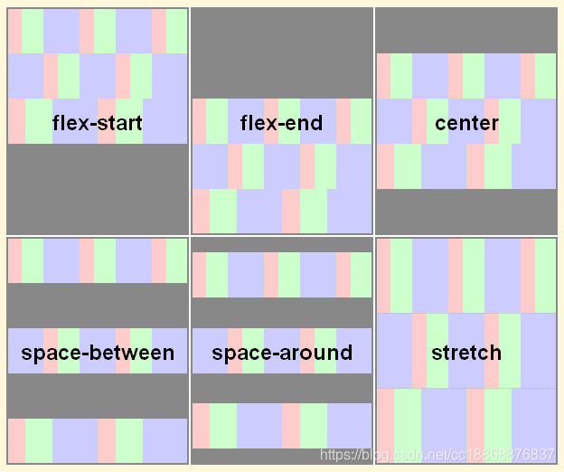

# Flex 布局

## 意义

相比以前 display + position + float 的方式布局，Flex 可以更简便地实现多种页面布局

## flex: 1 的意思？

- 是 flex-grow, flex-shrink 和 flex-basis 的简写，默认值为 0 1 auto。后两个是可选属性
- 定义项目的放大比例

## 容器属性

### flex-direction

- 决定主轴方向

### flex-wrap

- 让 Flex 项目换行排列
- 默认子元素都排在一条线上
- `nowrap(默认)`：所有子元素单行排列
- `wrap`：所有子元素多行排列，按从上到下的顺序
- `wrap-reverse`：所有子元素多行排列，按从下到上的顺序

### flex-flow

- flex-direction 属性和 flex-wrap 属性的简写形式

```css
.box {
  flex-flow: < 'flex-direction' > || < 'flex-wrap' >;
}
```

### justify-content

- 定义了项目在主轴上的对齐方式及额外空间的分配方式

```css
.box {
  justify-content: flex-start | flex-end | center | space-between | space-around | space-evenly;
}
```

### align-items

- 定义项目在交叉轴上的对齐方式

```css
.box {
  align-items: stretch | flex-start | flex-end | center | baseline;
}
```

### align-content

- 定义了在交叉轴方向的对齐方式及额外空间分配，类似于主轴上 justify-content 的作用

```css
.box {
  align-content: stretch | flex-start | flex-end | center | space-between | space-around;
}
```

### align-content 与 align-items 的区别？

- align-content 只适用多行的 flex 容器，也就是 flex 容器中的子项不止一行时该属性才有效果
- 当 flex 容器在交叉轴上有多余的空间时，将子项作为一个整体（属性值为：flex-start、flex-end、center 时）进行对齐
- 效果如下：



## 子元素属性

### order

- 控制元素在容器中的先后顺序
- 从小到大顺序排列，可以为负值，默认为 0

### flex-grow

- 正整数，定义项目的放大比例

### flex-shrink

- 定义了元素的缩小比例，默认为 1
- 即如果空间不足，该元素将被挤压
- 0 表示不缩小，负值无效

### flex-basis

- 定义元素在分配额外空间之前的缺省尺寸
- 属性值可以是长度（20%，10rem 等）或者关键字 auto，默认值 auto

### flex

- flex-grow, flex-shrink 和 flex-basis 的简写，默认值：`0 1 auto`，后两个可选

### align-self

- 定义项目的对齐方式，可覆盖 align-items，默认 auto
