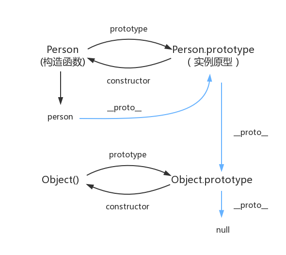

# 原型链和继承

## 原型链



### 描述

- 原型：每一个对象（null 除外）在创建的时候会关联另一个对象，这个对象就是原型，每一个对象都会从原型继承属性或方法，就是 prototype 属性
- 由相互关联的原型组成的链状结构就是原型链
- 原型对象上的属性和方法，能被对应构造函数创建的实例共享，这是 JavaScript 继承机制的基本设计
- JavaScript 对象通过 prototype 指向父类对象，直到指向 Object 对象，Object 原型指向 null 为止，这样就形成了一个原型指向的链条
- 访问实例的某个属性或方法，会首先在对象内寻找，找不到，才在对象的原型里去找，一直找到底
- instanceof、isPrototypeOf：判断是否处于原型链
- Object.hasOwnProperty()：检查对象自身中是否含有该属性
- for in 可以搜索原型属性
- 函数对象的 prototype --> 实例原型
- 实例（普通对象）的 `__proto__` --> 实例原型
- 原型的 constructor --> 关联的构造函数
- 实例原型的原型 --> Object
- Object 的原型 --> null，`Object.prototype.__proto__ === null`

::: tip

此时原型链停止查找  
null 表示“没有对象”，即该处不应该有值。  
所以 `Object.prototype.__proto__` 的值为 null 跟 Object.prototype 没有原型，其实表达了一个意思

:::

### 原型对象 和 构造函数

- 定义一个函数数据类型\普通函数\类的时候，自带一个 prototype 属性指向函数的原型对象
- 当函数经过 new 调用时，这个函数就成为了构造函数，返回一个新的实例，这个实例有一个 `__proto__` 属性，指向构造函数的原型对象

### 声明方法为什么要用 prototype

- 为了在类的各个实例间共享
- 通过该构造函数生成的实例所拥有的方法都是指向一个函数的索引，可以节省内存
- 不使用 prototype 定义的方法相当于类的静态方法，可以直接使用，不需要 new
- 使用 prototype 定义的方法相当于类的实例方法，必须 new 后才能使用

### prototype 和 proto 和 constructor 的关系

- prototype 用于访问函数的原型对象。它是函数所独有的，它是从一个函数指向一个对象。它的含义是函数的原型对象，任何函数在创建的时候，其实会默认同时创建该函数的 prototype 对象
- `__proto__` 用于访问对象实例的原型对象（或者使用 Object.getPrototypeOf()）
- `__proto__` 是对象独有的
- `__proto__` 作用就是当访问一个对象的属性时，如果该对象内部不存在这个属性，那么就会去它的 `__proto__` 属性所指向的那个对象（可以理解为父对象）里找，如果父对象也不存在这个属性，则继续往父对象的 `__proto__` 属性所指向的那个对象（可以理解为爷爷对象）里找，如果还没找到，则继续往上找，直到原型链顶端 null 空对象
- constructor 属性也是对象才拥有的，它是从一个对象指向一个函数，含义就是指向该对象的构造函数

### typeof 和 instanceof 区别

- typeof：判断一个变量的类型
- instanceof：判断一个变量是否是某个对象的实例
- instanceof 原理：能在实例的 原型对象链 中找到该构造函数的 prototype 属性所指向的 原型对象，就返回 true

### new 干了什么

new 操作符新建了一个空对象，这个对象原型指向构造函数的 prototype，执行构造函数后返回这个对象。

- 创建一个空对象
- 将构造函数的作用域赋给新对象，根据原型链，设置空对象的 `__proto__` 为构造函数的 prototype
- 构造函数的 this 指向这个对象，执行构造函数的代码（为这个新对象添加属性）
- 判断函数的返回值类型，如果是引用类型，就返回这个引用类型的对象

手写 new：

```jsx
function myNew(context, ...args) {
  const obj = new Object();
  obj.__proto__ = context.prototype;
  const res = context.apply(obj, args);
  return typeof res === 'object' ? res : obj;
}
```

## 继承

- 许多面向对象语言都支持两种继承方式: 接口继承 和 实现继承
- JavaScript 没有提供传统面向对象语言中的类式继承，而是通过原型委托的方式来实现对象与对象之间的继承
- JavaScript 也没有在语言层面提供对抽象类和接口的支持
- 接口继承只继承方法签名，而实现继承则继承实际的方法
- 在 JavaScript 中无法实现接口继承，只支持实现继承，而且其实现继承主要是依靠原型链来实现的
- 以对象字面量方式创建原型方法会破坏之前的原型链，因为这相当于重写了原型链

### ES6 和 ES5 继承区别

- <https://gist.github.com/zachrey/b3633b357134201e7d39d1c7d8c438fd>
- ES5 的继承一般是通过原型链模式或者构造函数模式来实现继承，ES5 的 Sub 构造函数的 prototype 指向的是 Function.prototype
- 而 ES6 实现的继承，Sub.prototype 的会指向 Parent
- this 的构造顺序是不一样的，ES5 的继承是先构造子对象然后再产生父对象，然后将父对象里面的属性复制到子对象中。而 ES6 是先使用 super()创建 父对象，然后再创建子对象。所以 this 的构造顺序不同。

### 原型链继承

- 直接通过原型继承属性和方法

```jsx
Son.prototype = new Father();
```

缺点：

- 原型中包含引用值的时候，会在所有实例间共享，修改子类引用类型属性会影响到父类
- 子类型在实例化时不能给父类型的构造函数传参

### 盗用构造函数

- 为了解决原型包含引用值导致的继承问题（含引用类型值的原型属性会被所有实例共享）
- 在子类型构造函数的内部调用父类型构造函数
- 优点是可以在子类构造函数中向父类构造函数传参

```jsx
function Father() {
  this.colors = ['red', 'blue', 'green'];
}
function Son() {
  Father.call(this);
  // 继承了Father，且向父类型传递参数
}
```

缺点：

- 必须在构造函数中定义方法，因此函数不能重用
- 子类也不能访问父类原型上定义的方法

### 组合继承

- 原型链继承和盗用构造函数继承的结合
- 使用原型链实现对原型属性和方法的继承
- 通过盗用构造函数来实现对实例属性的继承
- 既通过在原型上定义方法实现了函数复用，又能够保证每个实例都有它自己的属性

```jsx
function Father(name) {
  this.name = name;
  this.colors = ['red', 'blue', 'green'];
}
Father.prototype.sayName = function () {
  alert(this.name);
};
function Son(name, age) {
  // 继承属性
  Father.call(this, name);
  this.age = age;
}
// 继承方法
Son.prototype = new Father();
Son.prototype.constructor = Son;
Son.prototype.sayAge = function () {
  alert(this.age);
};
```

### 原型式继承

- 即相当于 ES6 的 Object.create()方法
- 适合不需要单独创建构造函数，但仍然需要在对象间共享信息的场合
- 创建一个临时构造函数
- 将传入的对象赋值给这个构造函数的原型
- 然后返回这个临时类型的一个实例

```jsx
function object(o) {
  function F() {}
  F.prototype = o;
  return new F();
}
```

### 寄生式继承

- 类似工厂模式
- 创建一个实现继承的函数，以某种方式增强对象，然后返回这个对象
- 适合主要关注对象，而不在乎类型和构造函数的场景
- 通过寄生式继承给对象添加函数会导致函数难以重用，与构造函数模式类似

```jsx
var book = { name: 'js book', likeBook: ['html book', 'css book'] };
function createBook(obj) {
  // 通过原型方式创建新的对象
  var o = new inheritObject(obj);
  // 拓展新对象
  o.getName = function (name) {
    console.log(name);
  };
  // 返回拓展后的新对象
  return o;
}
```

### 寄生组合继承

- 组合继承的问题：会调用两次父类型构造函数，创建子类原型时、在子类构造函数内部
- 通过借用构造函数来继承属性
- 通过原型链的混成形式来继承方法
- 不必为了指定子类型的原型而调用超类型的构造函数，我们所需要的无非就是超类型原型的一个副本而已

```jsx
function Father(foo) {
  this.foo = foo;
}
Father.prototype.printFoo = function () {
  console.log(this.foo);
};
function Son(bar) {
  this.bar = bar;
  Father.call(this);
}
Son.prototype = Object.create(Super.prototype);
Son.prototype.constructor = Son;
```

### ES6 的 extends

```jsx
class Father {
  constructor(foo) {
    this.foo = foo;
  }
  printFoo() {
    console.log(this.foo);
  }
}
class Son extends Father {
  constructor(foo, bar) {
    super(foo);
    this.bar = bar;
  }
}
```

## 参考

- <https://github.com/mqyqingfeng/blog/issues/2>
