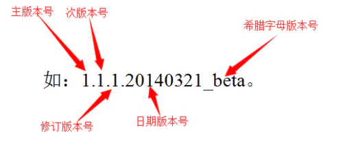

# NPM

## npm 的使用

- 通过环境变量读取 package.json 中的属性：process.env.npm_package_name
- 获取当前正在运行的 npm script 脚本名称：process.env.npm_lifecycle_event
- 可通过添加 pre- 和 post- 前缀声明钩子脚本
- 使用 link 调试本地包
- npm run 新建的 Shell 环境，会将当前目录的 node_modules/.bin 加入 PATH 环境变量，执行结束后，再将 PATH 环境变量恢复，这意味着，当前目录的 node_modules/.bin 子目录里面的所有脚本，都可以直接用脚本名调用，而不必加上路径或者 npx
- script 中可通过 `$npm_config_tag` 获取 shell 中的配置值；如果 env 环境变量中存在以 `npm_config_*` 为前缀的环境变量，则也会被识别为 npm 的配置属性；以及各个级别的 .npmrc 配置文件

  ```bash
  npm run serve --params  // 参数params将转化成process.env.npm_config_params = true
  npm run serve --params=123 // 参数params将转化成process.env.npm_config_params = 123
  ```

- npm version patch
  - 升级小版本，还会默认执行 git add->git commit->git tag 操作，也可以通过配置禁止这一默认行为
- 查看所有可用命令：`npm run`
- npm ci
  - npm ci 只根据 package-lock.json 来安装包，而 npm install 在安装的过程中会结合 package.json 和 package-lock.json 来计算依赖包版本的差异性问题。所以相比较 npm install，npm ci 既能提升包的安装速度，又能避免在生产化境中出现包版本不一致的问题
  - 如果项目中已经存在 node_modules，npm ci 将会先删除它，然后再安装
  - 如果检测到 package.json 和 package-lock.json 中的依赖项不匹配的话，npm ci 将退出并报错，而不是更新两个文件中的版本号
  - 要求项目中必须具有 package-lock.json 或 npm-shrinkwrap.json，否则执行 npm ci 将会报错
  - npm ci 只能一次安装整个项目的依赖包，而不能为项目安装单个依赖包

## npx

- 直接运行 node_modules/.bin 目录下的可执行文件
- npx 想要解决的主要问题，就是调用项目内部安装的模块，可以避免全局安装模块
- npx 的原理很简单，就是运行的时候，会到 node_modules/.bin 路径和环境变量 PATH 里面，检查命令是否存在。由于 npx 会检查环境变量 PATH，所以系统命令也可以调用

## npm 检查配置的优先级

- 项目级的 .npmrc 文件 > 用户级的 .npmrc 文件 > 全局级的 .npmrc > npm 内置的 .npmrc 文件

## package-lock.json、yarn.lock 的作用

- 锁定安装时的包的版本号，并且需要上传到 git，以保证其他人在 npm install 时大家的依赖能保证一致
- package.json 文件只能锁定大版本，也就是版本号的第一位，并不能锁定后面的小版本，你每次 npm install 都是拉取的该大版本下的最新的版本，为了稳定性考虑我们几乎是不敢随意升级依赖包的，这将导致多出来很多工作量，测试/适配等，所以 package-lock.json 文件出来了，当你每次安装一个依赖的时候就锁定在你安装的这个版本。

## npm install 流程

- 检查项目中是否有 package-lock.json 文件
- 如果有， 检查 package-lock.json 和 package.json 声明的依赖是否一致：
  - 一致， 直接使用 package-lock.json 中的信息，从网络或者缓存中加载依赖
  - 不一致， 根据上述流程中的不同版本进行处理
- 如果没有， 那么会根据 package.json 递归构建依赖树，然后就会根据构建好的依赖去下载完整的依赖资源，在下载的时候，会检查有没有相关的资源缓存:
  - 存在， 直接解压到 node_modules 文件中
  - 不存在， 从 npm 远端仓库下载包，校验包的完整性，同时添加到缓存中，解压到 node_modules 中
- 最后， 生成 package-lock.json 文件
- 在我们实际的项目开发中，使用 npm 作为团队的最佳实践: 同一个项目团队，应该保持 npm 版本的一致性。

> 如果希望一个模块不管是否安装过，npm 都要强制重新安装，可以使用 -f 或–force 参数

## npm 的缺点

- 包之间相互依赖，导致嵌套地狱，会形成一棵巨大的依赖树
- 依赖层级过深，有问题不利于排查和调试
- 安装结果占据大量空间资源，安装时间长

## yarn 解决的问题

- 采用模块扁平化的安装模式: 将不同版本的依赖包，按照一定的策略，归结为单个版本；以避免创建多个版本造成工程的冗余（目前版本的 npm 也有相同的优化）
- 网络性能更好: yarn 采用了请求排队的理念，类似于并发池连接，能够更好的利用网络资源；同时也引入了一种安装失败的重试机制
- 采用缓存机制，实现了离线模式 （目前的 npm 也有类似的实现）

## 依赖包版本号

- 采用了 semver 规范作为依赖版本管理方案
- 一般格式：主版本号.次版本号.修订号（x.y.z）

## package.json

参考：<https://docs.npmjs.com/cli/v8/configuring-npm/package-json>

- bin：表示的是一个可执行文件到指定文件源的映射
  ```json
  "bin": {
    "someTool": "./bin/someTool.js"
  }
  ```
- file：需要上传 npm 的文件，一般设置只上传编译产物，加快下载包的速度
- main：指定加载的入口文件
- browser：定义 npm 包在 browser 环境下的入口文件。如果 npm 包只在 web 端使用，并且严禁在 server 端使用，使用 browser 来定义入口文件
- module：定义 npm 包的 ESM 规范的入口文件，browser 环境和 node 环境均可使用。如果 npm 包导出的是 ESM 规范的包，使用 module 来定义入口文件
- man：指定帮助文档
- typings：指定 TypeScript 的入口文件

### dependencies

- dependencies
  - 最终上线或者发布 npm 包时所需要，例如 vue 框架、UI 组件库
  - 发布 npm 包的时候，包中的 dependencies 依赖项在安装该包的时候会被一起下载，devDependencies 依赖项则不会
- devDependencies
  - 开发和测试时需要，例如打包工具、css 预处理器、测试框架等
- peerDependencies
  - 如果你安装我，那么你最好也要按照我的要求安装 A、B 和 C
  - 可以用来防止多次引入相同的库
- optionalDependencies
  - 这种依赖中的依赖项即使安装失败了，也不影响整个安装的过程
  - 如果一个依赖同时出现在 dependencies 和 optionalDependencies 中，那么 optionalDependencies 会获得更高的优先级
  - 在实际项目中，如果某个包已经失效，我们通常会寻找它的替代者，或者换一个实现方案。不确定的依赖会增加代码判断和测试难度，所以这个依赖项还是尽量不要使用

### 版本号

- 第一部分为主版本号，变化了表示有了一个不兼容上个版本的大更改
- 第二部分为次版本号，变化了表示增加了新功能，并且可以向后兼容
- 第三部分为修订版本号，变化了表示有 bug 修复，并且可以向后兼容
- 第四部分为日期版本号加希腊字母版本号，希腊字母版本号共有五种，分别为 base、alpha、beta、RC、release



#### 希腊版本号

**Base**
此版本表示该软件仅仅是一个假页面链接，通常包括所有的功能和页面布局，但是 页面中的功能都没有做完整的实现，只是做为整体网站的一个基础架构。

**Alpha**
软件的初级版本，表示该软件在此阶段以实现软件功能为主，通常只在软件开发者 内部交流，一般而言，该版本软件的 Bug 较多，需要继续修改，是测试版本。测试 人员提交 Bug 经开发人员修改确认之后，发布到测试网址让测试人员测试，此时可 将软件版本标注为 alpha 版。

**Beta**
该版本相对于 Alpha 版已经有了很大的进步，消除了严重错误，但还需要经过多次 测试来进一步消除，此版本主要的修改对象是软件的 UI。修改的的 Bug 经测试人 员测试确认后可发布到外网上，此时可将软件版本标注为 beta 版。

**RC**
该版本已经相当成熟，基本上不存在导致错误的 Bug，与即将发行的正式版本相差无几。

**Release**
该版本意味“最终版本”，在前面版本的一系列测试版之后，终归会有一个正式的版本，是最终交付用户使用的一个版本。该版本有时也称标准版。

#### 版本号的写法

- `version` 必须确切匹配这个 version
- `>version` 必须大于这个 version
- `>=version` 必须大于等于这个 version
- `<version` 必须小于这个 version
- `<=version` 必须小于等于这个 version
- `~version` 大约相当于 version
- `^version` 与 version 兼容
- `1.2.x` 可以是 1.2.0、1.2.1 等，但不能是 1.3.0
- `http://...` URL 作为依赖项
- `*` 匹配任何版本
- `""`(空字符串) 匹配任何版本，和 `*` 一样
- `version1 - version2` 相当于 `>=version1 <=version2`
- `range1 || range2` range1 或 range2 其中一个满足时采用该 version
- `git...` Git URL 作为依赖项
- `user/repo` GitHub URLs
- `tag` 一个以 tag 发布的指定版本，参考 npm-tag
- `path/path/path` 本地 Paths

## 域级包管理

- 以@开头的包名
- 由于用@声明了该包，npm 会默认将此包认定为私有包，而在 npm 上托管私有包是需要收费的，所以为了避免发布私有包，可以在发布时添加--accss=public 参数告知 npm 这不是一个私有包
- 域级包不一定就是私有包，但是私有包一定是一个域级包
- 在安装域级包时需要按照域级包全名来安装：`npm install @scopeName/package`

## 发布一个支持 tree shaking 机制的包

- tree shaking 是依赖 ES Module 的模块特性来工作的，那是因为 ES Module 模块的依赖关系是在编译时确定的（和运行时无关），并且之后不能再改变，所以基于此特性可以进行可靠的静态分析
- 设置 module 字段：该字段指向一个既符合 ES Module 模块规范但是又使用 ES5 语法的源文件。这么做的目的是为了启动 tree shaking 的同时，又避免代码兼容性的问题

  ```json
  {
    "main": "./lib/index.js", // 指向 CommonJS 模块规范的代码入口文件
    "module": "./lib/index.es.js" // 指向 ES Module 模块规范的代码入口文件
  }
  ```

  如上配置要求你的包中要发布两种模块规范的版本。如果你的 npm 环境支持 module 字段，则会优先使用 ES Module 模块规范的入口文件，如果不支持则会使用 CommonJS 模块规范的入口文件。

- 其实要想发布一个支持 tree shaking 机制的包，最主要是要构建出一个符合 module 字段要求的源文件，也就是一个既符合 ES Module 模块规范但是又采用 ES5 语法的源文件。
  rollup 可以直接构建出符合 ES Module 模块规范的文件，但是 webpack 不能。所以我们只需要使用 rollup 提供的构建能力，在配置文件中把 output 的格式设置为 es 即可
- 为了更好地使用 ES Module 模块规范来开启 tree shaking 功能，优先选用 rollup 来开发 npm 包
- 基于 ES6 模块规范是为了用户在使用我们的包时可以享受 Tree Shaking 带来的好处；使用 ES5 语法书写是为了用户在配置 babel 插件时可以放心的屏蔽 node_modules 目录

## 参考

- <https://www.ruanyifeng.com/blog/2016/10/npm_scripts.html>
