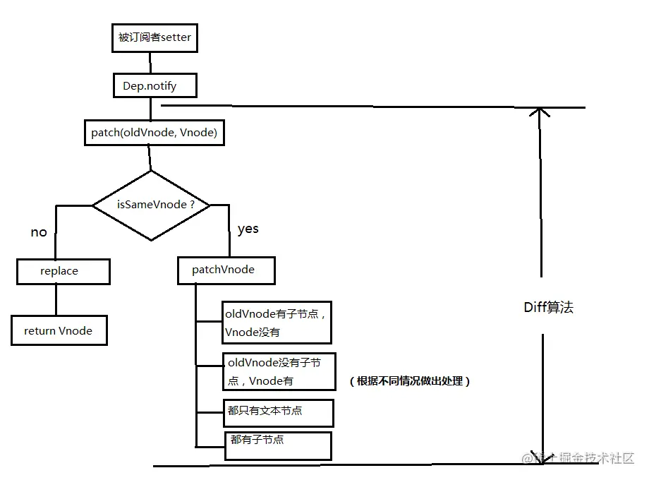

# vue 中的 diff 算法

- diff 的过程就是调用名为 patch 的函数，比较新旧节点，一边比较一边给真实的 DOM 打补丁

## diff 的比较方式

- 比较新旧节点的时候，比较只会在同层级进行，不会跨层级比较

## diff 流程

当数据发生改变时，set 方法会调用 Dep.notify 通知所有订阅者（Watcher），订阅者就会调用 patch 给真实的 DOM 打补丁，更新相应的视图



## patch 函数核心实现

```javascript
function patch(oldVnode, vnode) {
  // 判断两节点是否值得比较
  if (sameVnode(oldVnode, vnode)) {
    patchVnode(oldVnode, vnode);
  } else {
    // 不值得比较则用 Vnode 替换 oldVnode
    const oEl = oldVnode.el; // 当前 oldVnode 对应的真实元素节点
    let parentEle = api.parentNode(oEl); // 父元素
    createEle(vnode); // 根据 Vnode 生成新元素
    if (parentEle !== null) {
      api.insertBefore(parentEle, vnode.el, api.nextSibling(oEl)); // 将新元素添加进父元素
      api.removeChild(parentEle, oldVnode.el); // 移除以前的旧元素节点
      oldVnode = null;
    }
  }
  return vnode;
}
```

```javascript
// 判断两节点是否值得比较方法
function sameVnode(a, b) {
  return (
    a.key === b.key && // key 值
    a.tag === b.tag && // 标签名
    a.isComment === b.isComment && // 是否为注释节点
    // 是否都定义了 data，data 包含一些具体信息，例如 onclick，style
    isDef(a.data) === isDef(b.data) &&
    sameInputType(a, b) // 当标签是 <input> 的时候，type 必须相同
  );
}
```

```javascript
/*
- 值得比较，调用 patchVnode
- 找到对应的真实 dom，称为 el
- 判断 Vnode 和 oldVnode 是否指向同一个对象，如果是，那么直接 return
- 如果他们都有文本节点并且不相等，那么将 el 的文本节点设置为 Vnode 的文本节点
- 如果 oldVnode 有子节点而 Vnode 没有，则删除 el 的子节点
- 如果 oldVnode 没有子节点而 Vnode 有，则将 Vnode 的子节点真实化之后添加到 el
- 如果两者都有子节点，则执行 updateChildren 函数比较子节点，这一步很重要
*/

function patchVnode(oldVnode, vnode) {
  const el = (vnode.el = oldVnode.el);
  let i,
    oldCh = oldVnode.children,
    ch = vnode.children;
  if (oldVnode === vnode) return;
  if (oldVnode.text !== null && vnode.text !== null && oldVnode.text !== vnode.text) {
    api.setTextContent(el, vnode.text);
  } else {
    updateEle(el, vnode, oldVnode);
    if (oldCh && ch && oldCh !== ch) {
      updateChildren(el, oldCh, ch);
    } else if (ch) {
      createEle(vnode); //create el's children dom
    } else if (oldCh) {
      api.removeChildren(el);
    }
  }
}
```

```javascript
/* 
- 将 Vnode 的子节点 Vch 和 oldVnode 的子节点 oldCh 提取出来
- oldCh 和 vCh 各有两个头尾的变量 StartIdx 和 EndIdx，它们的 2 个变量相互比较，一共有 4 种比较方式。如果 4 种比较都没匹配，如果设置了 key，就会用 key 进行比较，在比较的过程中，变量会往中间靠，一旦 StartIdx > EndIdx 表明 oldCh 和 vCh 至少有一个已经遍历完了，就会结束比较
*/

function updateChildren(parentElm, oldCh, newCh) {
  let oldStartIdx = 0,
    newStartIdx = 0;
  let oldEndIdx = oldCh.length - 1;
  let oldStartVnode = oldCh[0];
  let oldEndVnode = oldCh[oldEndIdx];
  let newEndIdx = newCh.length - 1;
  let newStartVnode = newCh[0];
  let newEndVnode = newCh[newEndIdx];
  let oldKeyToIdx;
  let idxInOld;
  let elmToMove;
  let before;

  while (oldStartIdx <= oldEndIdx && newStartIdx <= newEndIdx) {
    if (oldStartVnode == null) {
      // 对于 vnode.key 的比较，会把 oldVnode = null
      oldStartVnode = oldCh[++oldStartIdx];
    } else if (oldEndVnode == null) {
      oldEndVnode = oldCh[--oldEndIdx];
    } else if (newStartVnode == null) {
      newStartVnode = newCh[++newStartIdx];
    } else if (newEndVnode == null) {
      newEndVnode = newCh[--newEndIdx];
    } else if (sameVnode(oldStartVnode, newStartVnode)) {
      patchVnode(oldStartVnode, newStartVnode);
      oldStartVnode = oldCh[++oldStartIdx];
      newStartVnode = newCh[++newStartIdx];
    } else if (sameVnode(oldEndVnode, newEndVnode)) {
      patchVnode(oldEndVnode, newEndVnode);
      oldEndVnode = oldCh[--oldEndIdx];
      newEndVnode = newCh[--newEndIdx];
    } else if (sameVnode(oldStartVnode, newEndVnode)) {
      patchVnode(oldStartVnode, newEndVnode);
      api.insertBefore(parentElm, oldStartVnode.el, api.nextSibling(oldEndVnode.el));
      oldStartVnode = oldCh[++oldStartIdx];
      newEndVnode = newCh[--newEndIdx];
    } else if (sameVnode(oldEndVnode, newStartVnode)) {
      patchVnode(oldEndVnode, newStartVnode);
      api.insertBefore(parentElm, oldEndVnode.el, oldStartVnode.el);
      oldEndVnode = oldCh[--oldEndIdx];
      newStartVnode = newCh[++newStartIdx];
    } else {
      // 使用 key 时的比较
      if (oldKeyToIdx === undefined) {
        oldKeyToIdx = createKeyToOldIdx(oldCh, oldStartIdx, oldEndIdx); // 有 key 生成 index 表
      }
      idxInOld = oldKeyToIdx[newStartVnode.key];
      if (!idxInOld) {
        api.insertBefore(parentElm, createEle(newStartVnode).el, oldStartVnode.el);
        newStartVnode = newCh[++newStartIdx];
      } else {
        elmToMove = oldCh[idxInOld];
        if (elmToMove.sel !== newStartVnode.sel) {
          api.insertBefore(parentElm, createEle(newStartVnode).el, oldStartVnode.el);
        } else {
          patchVnode(elmToMove, newStartVnode);
          oldCh[idxInOld] = null;
          api.insertBefore(parentElm, elmToMove.el, oldStartVnode.el);
        }
        newStartVnode = newCh[++newStartIdx];
      }
    }
  }
  if (oldStartIdx > oldEndIdx) {
    before = newCh[newEndIdx + 1] == null ? null : newCh[newEndIdx + 1].el;
    addVnodes(parentElm, before, newCh, newStartIdx, newEndIdx);
  } else if (newStartIdx > newEndIdx) {
    removeVnodes(parentElm, oldCh, oldStartIdx, oldEndIdx);
  }
}
```

## 参考

- <https://juejin.cn/post/6844903607913938951>
