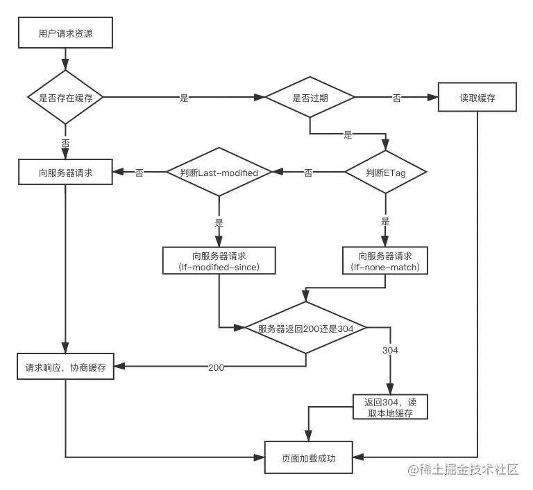

# 浏览器缓存

- Web 缓存种类： 数据库缓存，CDN 缓存，服务器缓存（例如 redis），浏览器缓存
- 浏览器实现了 http 缓存
- 浏览器缓存类型：强缓存，协商缓存
- 只有 get 请求会缓存，post 请求不会

## 缓存位置

### Memory Cache

- 内存中缓存
- 主要包含的是当前页面中已经抓取到的资源，已经下载的样式、脚本、图片
- 读取高效、持续性很短
- 随着进程的释放而释放，杀进程或者关闭 Tab 页面会被释放
- 对于大文件来说，大概率是不存储在 Memory Cache 的，反之优先

### Disk Cache

- 磁盘缓存
- 浏览器获取当前系统内存使用率，过高的话，优先存储进 Disk Cache
- 所有类型资源都可以放
- 速度较慢
- 不会被释放
- 容量大

### Service Worker

- Service Worker 运行在 JavaScript 主线程之外，虽然由于脱离了浏览器窗体无法直接访问 DOM，但是它可以完成离线缓存、消息推送、网络代理等功能

## 缓存过程

- 每一次请求时，浏览器保存请求结果和缓存标识
- 再次请求：存在缓存结果和缓存标识：检查是否命中强缓存，命中则直接使用上次保存的请求结果，返回 200，不向服务器发起请求；否则，使用协商缓存
- 不存在该缓存结果和缓存标识：直接向服务器发起请求

### 强缓存

- 向浏览器缓存查找该请求结果，并根据该结果的缓存规则来决定是否使用该缓存结果的过程
- 当符合命中强缓存的条件，不向服务器发送请求，直接从缓存中读取资源，返回 200 状态码
- 控制强缓存的 header（按优先级小到大排序）：expires < pragma < cache-control
- cache-control 优先级最高，当不支持 http1.1 的环境才会使用 expires 或者 pragma
- expires
  ::: note
  资源到期时间、格式为格林尼治时间戳  
  如果未超过过期时间，直接使用该缓存  
  缺点：要求客户端和服务端时钟严格同步，本地时间可以自己修改  
  :::

- pragma
  ::: note
  HTTP 1.0  
  用于禁用网页缓存  
  取值为 no-cache，和 cache-control 的 no-cache 效果一样  
  :::

- cache-control
  ::: note
  HTTP 1.1 新增  
  取值  
   public：资源客户端和服务器都可以缓存  
   privite：资源只有客户端可以缓存  
   no-cache：客户端缓存资源，但是是否缓存需要经过协商缓存来验证  
   no-store：不使用缓存  
   max-age：缓存保质期
  :::

### 协商缓存

- 强缓存失效后，浏览器携带缓存标识向服务器发送请求，由服务器根据缓存标识来决定是否使用缓存的过程
- 会向服务器发送请求

::: note

协商缓存过程：

- 服务器发现资源无需更新，返回 304
- 浏览器从本地缓存中获取资源，继续使用
- 如果服务器发现该资源更新了，返回该资源，状态码 200
- 浏览器更新该资源和缓存标识到本地缓存

:::

::: note

相关 header：

Last-Modified / If-Modified-Since

- 存在的问题：时间单位只精确到秒，如果文件 1 秒内改变多次，无法确保缓存精度；有可能文件内容没变，但是修改时间因为某些原因变了，人为修改之类的
- Last-Modified（响应头）：资源在服务器最后被修改的时间
- If-Modified-Since（请求头）
  - 携带上次请求返回的 Last-Modified
  - 告诉服务器该资源上次请求时的最后被修改时间
  - 服务器做对比后决定协商缓存是否生效，返回 304 或 200

Etag / If-None-Match

- 优先级高于 Last-Modified，解决 Last-Modified 的问题，但性能比 Last-Modified 差，Etag 需要计算
- Etag（响应头）：当前资源文件唯一标识，由服务器生成，由文件内容决定
- If-None-Match（请求头）
  - 携带上次请求该资源时返回的 Etag，告诉服务器
  - 服务器做对比，一致则代表生效，返回 304 或 200

:::

## 实际应用

- 需要实时更新频繁变动的资源，设置 cache-control 为 no-cache
- 不常变化的资源，例如 jquery，设置 cache-control 为 max-age=一个很长的时间
- 单页应用部署时，入口 html 文件使用协商缓存（确保 html 入口是最新的，能够及时更新）

## 按下 F5 或 ctrl+F5 时发生了什么

- ctrl+f5：跳过强缓存和协商缓存，直接从服务器加载资源
- f5：跳过强缓存，会检查协商缓存
- 浏览器地址栏中输入 URL 回车：走正常流程

## 参考

- https://www.jianshu.com/p/54cc04190252
