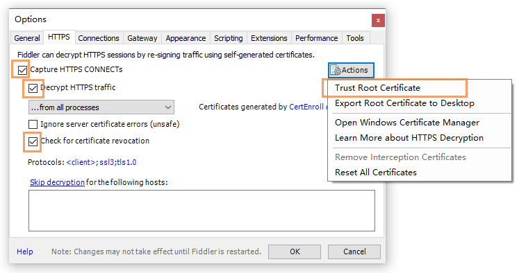
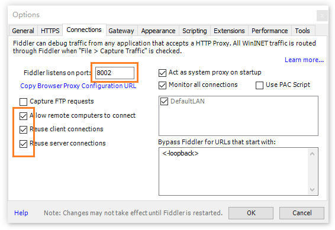

# 真机调试微信 h5 页面

真机上通过 https 和可信域名访问本地开发服务，进行本地调试

## 条件

- 手机和 pc 处在同一局域网环境
- pc 安装 Fiddler
- 假设可信域名为 wx-dev.com
- 假设 pc 局域网 ip 为 192.168.1.106

## 本地 hosts 文件添加映射

编辑 hosts 文件，将域名映射到 pc 局域网 ip

```txt
## 微信开发
192.168.1.106 wx-dev.com
```

## 设置 Fiddler

- tools -> options
- https 设置



- Connections 设置



## 修改 webpack 配置

- 开启 https
  <https://webpack.js.org/configuration/dev-server/#devserverhttps>

- 本地服务端口号改成 443

此时可在 pc 浏览器通过 https://wx-dev.com 访问本地服务

## 修改手机代理

- 进入手机 wlan 设置，选择连接的 wifi，代理选择手动
- 主机名填 pc 局域网 ip，端口填 Fiddler 代理设置中的端口号

## 手机安装 Fiddler 证书

- 手机浏览器访问 `http://[pc局域网ip]:[Fiddler 代理端口号]`，这里是 `http://192.168.1.106:8002`
- 点击下载 Fiddler 证书，进入手机 wlan 设置安装证书

此时手机浏览器可通过 https://wx-dev.com 访问 pc 上的本地服务。

结束
