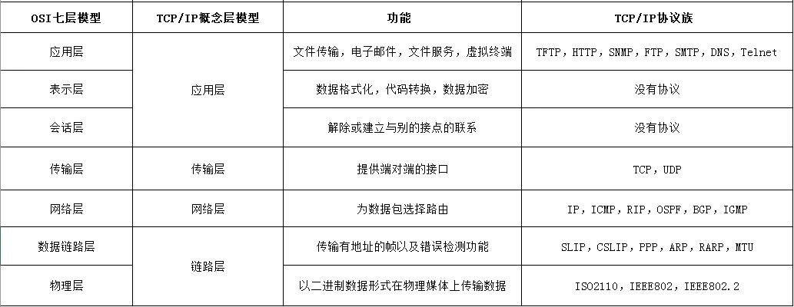
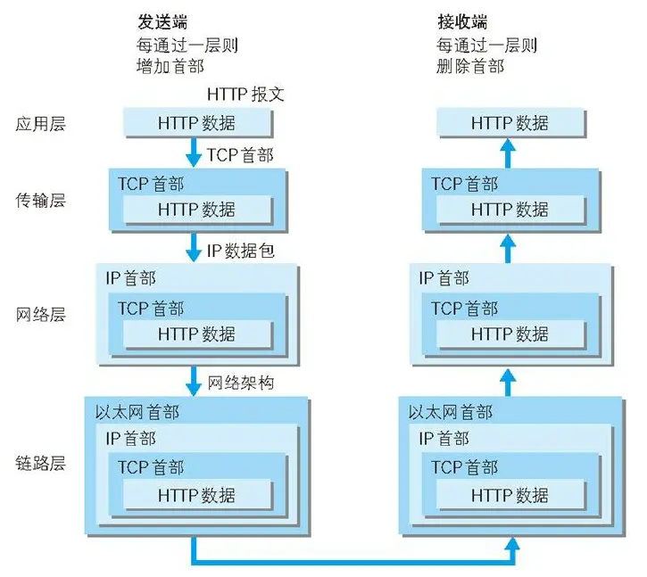

# 网络

## 网络体系结构分层

## TCP/IP 通信传输流

- 利用 TCP/IP 协议族进行网络通信时，会通过分层顺序与对方进行通信。发送端从应用层往下走，接收端则从链路层往上走
- 发送端在层与层间传输数据时，没经过一层都会被加上首部信息，接收端每经过一层都会删除一条首部

## TCP/IP

- 利用 IP 进行通信时所必须用到的协议群的统称，协议的集合
- 具体来说，IP 或 ICMP、TCP 或 UDP、TELNET 或 FTP、以及 HTTP 等都属于 TCP/IP 协议族

### 端口号

用来识别同一台计算机中进行通信的不同应用程序。因此，它也被称为程序地址

### UDP

- 处于 TCP/IP 分层模型中的传输层
- 不提供复杂的控制机制，利用 IP 提供面向无连接的通信服务
- 将应用程序发来的数据在收到的那一刻，立即按照原样发送到网络上的一种机制。即使是出现网络拥堵的情况，UDP 也无法进行流量控制等避免网络拥塞行为
- 传输途中出现丢包，UDP 也不负责重发
- 甚至当包的到达顺序出现乱序时也没有纠正的功能
- 应用：1.包总量较少的通信（DNS、SNMP 等）；2.视频、音频等多媒体通信（即时通信）；3.限定于 LAN 等特定网络中的应用通信；4.广播通信（广播、多播）

### TCP

- 处于 TCP/IP 分层模型中的传输层
- 充分地实现了数据传输时各种控制功能，可以进行丢包时的重发控制，还可以对次序乱掉的分包进行顺序控制
- 作为一种面向有连接的协议，只有在确认通信对端存在时才会发送数据，从而可以控制通信流量的浪费
- 在 IP 这种无连接的网络上也能够实现高可靠性的通信（ 主要通过检验和、序列号、确认应答、重发控制、连接管理以及窗口控制等机制实现）

### TCP 和 UDP 的区别

- tcp 是面向连接的，udp 是无连接的，即发送数据前不需要先建立链接
- tcp 提供可靠的服务，基于三次握手，UDP 是不可靠的
- tcp 只能是 1 对 1 的，UDP 支持 1 对 1,1 对多
- UDP 的头部开销比 TCP 的更小：tcp 的首部较大为 20 字节，而 UDP 只有 8 字节

### tcp 三次握手

#### 原因

- 由 TCP 的自身特点可靠传输决定的，为了在数据通信开始之前先做好两端之间的准备工作
- 客户端和服务端都需要知道各自是否可收发，因此需要三次握手，需要客户端和服务器端总共发送三个包以确认连接的建立
- 第一次握手可以确认客服端的发送能力，第二次握手，确认了服务端的发送能力和接收能力，所以第三次握手才可以确认客户端的接收能力。不然容易出现丢包的现象

- 客户端发送一个带 SYN=1，Seq=X 的数据包到服务器端口（第一次握手，由浏览器发起，告诉服务器我要发送请求了）
- 服务器发回一个带 SYN=1，ACK=X+1，Seq=Y 的响应包以示传达确认信息（第二次握手，由服务器发起，告诉浏览器我准备接受了，你赶紧发送吧）
- 客户端再回传一个带 ACK=Y+1，Seq=Z 的数据包，代表“握手结束”（第三次握手，由浏览器发送，告诉服务器，我马上就发了，准备接受吧）

**简版：**

- 1：客户端 –-> 发送带有 SYN 标志的数据包–->服务端（我要发送请求了~）
- 2：服务端 –-> 发送带有 SYN/ACK 标志的数据包 -–> 客户端（我准备接受了，你赶紧发送吧~）
- 3：客户端 –-> 发送带有带有 ACK 标志的数据包 -–> 服务端（我马上就发了，准备接受吧~）

### tcp 四次挥手

- 终止 TCP 连接，需要客户端和服务端总共发送 4 个包以确认连接的断开
- 由于 TCP 连接是全双工的，因此，每个方向都必须要单独进行关闭

- 发起方向被动方发送报文，Fin、Ack、Seq，表示已经没有数据传输了。并进入 FIN_WAIT_1 状态。(第一次挥手：由浏览器发起的，发送给服务器，我请求报文发送完了，你准备关闭吧)
- 被动方发送报文，Ack、Seq，表示同意关闭请求。此时主机发起方进入 FIN_WAIT_2 状态。(第二次挥手：由服务器发起的，告诉浏览器，我请求报文接受完了，我准备关闭了，你也准备吧)
- 被动方向发起方发送报文段，Fin、Ack、Seq，请求关闭连接。并进入 LAST_ACK 状态。(第三次挥手：由服务器发起，告诉浏览器，我响应报文发送完了，你准备关闭吧)
- 发起方向被动方发送报文段，Ack、Seq。然后进入等待 TIME_WAIT 状态。被动方收到发起方的报文段以后关闭连接。发起方等待一定时间未收到回复，则正常关闭。(第四次挥手：由浏览器发起，告诉服务器，我响应报文接受完了，我准备关闭了，你也准备吧)

**简版：**

- 1：客户端 --> 发送一个 FIN，用来关闭客户端到服务器的数据传送（我请求报文发送完了，你准备关闭吧~）
- 2：服务器 --> 收到这个 FIN，发回一个 ACK，确认序号为收到的序号加 1。和 SYN 一样，一个 FIN 将占用一个序号（我请求报文接受完了，我准备关闭了，你也准备吧）
- 3：服务器 --> 关闭与客户端的连接，发送一个 FIN --> 客户端（我响应报文发送完了，你准备关闭吧）
- 4：客户端 --> 发回 ACK 报文确认，并将确认序号设置为收到序号加 1（我响应报文接受完了，我准备关闭了，你也准备吧）

## DNS

- 根据域名查出 IP 地址的服务

## WebSocket

- HTML5 提供的一种浏览器与服务器进行全双工通讯的网络技术，属于应用层协议
- 基于 TCP 传输协议
- 浏览器和服务器只需要完成一次握手，两者之间就直接可以创建持久性的连接， 并进行双向数据传输

## 参考

- <http://www.ruanyifeng.com/blog/2016/06/dns.html>
- https://www.cnblogs.com/leezhxing/p/4524176.html
- https://juejin.cn/post/6844904100035821575
- https://juejin.cn/post/6844903510509633550
